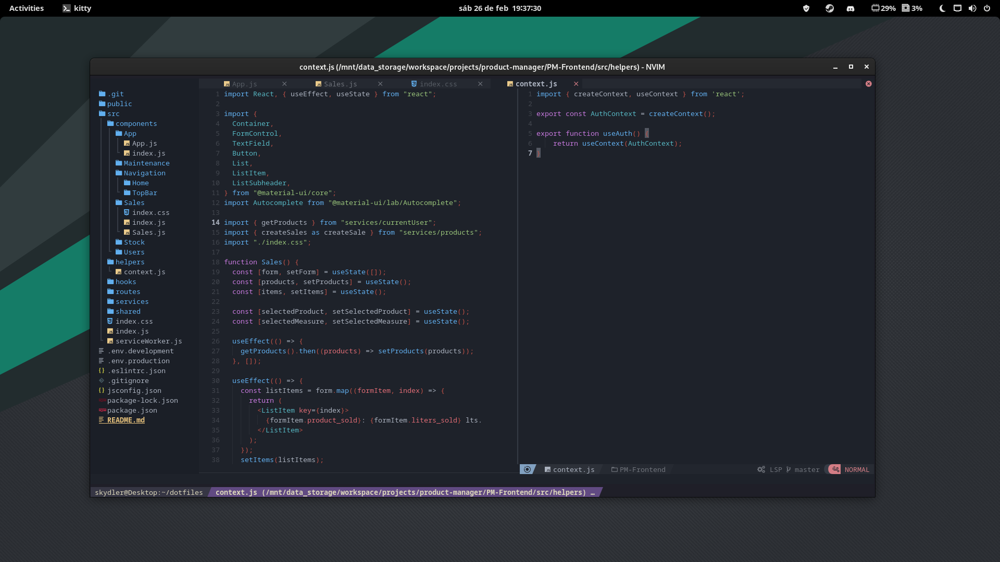

# Dotfiles

Hope you catch something new!



## Packages

- Zsh
  - [Ohmyzsh](https://github.com/ohmyzsh/ohmyzsh)
    - [Syntax-highlighting](https://github.com/zsh-users/zsh-syntax-highlighting/blob/master/INSTALL.md)
    - [Autosuggetions](https://github.com/zsh-users/zsh-autosuggestions/blob/master/INSTALL.md)
- [Starship](https://starship.rs/guide/#%F0%9F%9A%80-installation)
- [Kitty](https://sw.kovidgoyal.net/kitty/binary/)
- [NvChad](https://nvchad.com/docs/quickstart/install)
- [ripgrep](https://github.com/BurntSushi/ripgrep)
- [Neovim](https://neovim.io/)
  - python3-neovim
- [NodeJs](https://nodejs.org/en)
- [Yazi](https://yazi-rs.github.io/docs/installation)

## Installation

```shell
git clone https://github.com/Skydler/dotfiles.git

# Creating soft links on home folder
ln -s ~/dotfiles/zsh/.zsh_aliases ~/.zsh_aliases
ln -s ~/dotfiles/zsh/.zshrc ~/.zshrc
ln -s ~/dotfiles/prompt/starship.toml ~/.config/starship.toml
ln -s ~/dotfiles/kitty/kitty.conf ~/.config/kitty/kitty.conf
ln -s ~/dotfiles/nvim ~/.config/nvim
ln -s ~/dotfiles/yazi ~/.config/yazi
```
